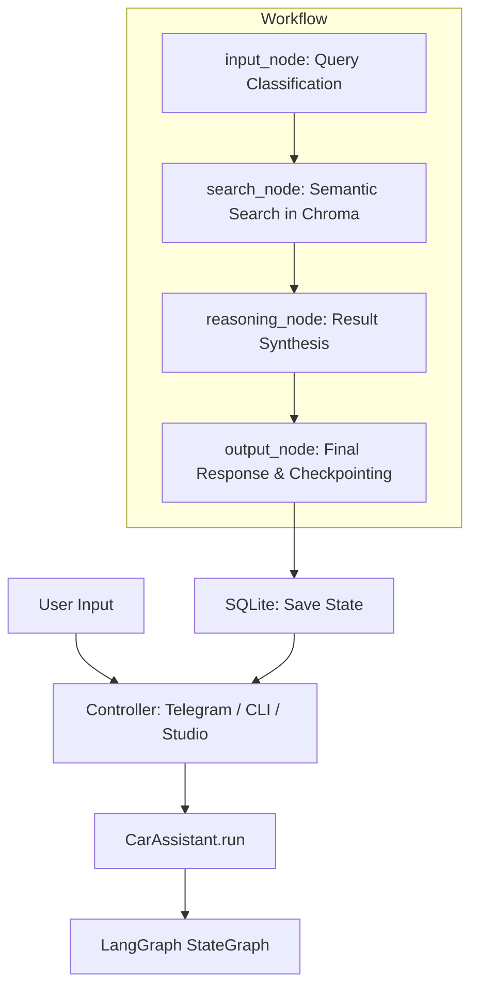

# AutoService AI Sales Agent (LangGraph + SQLite)

[](https://python.org)
[](https://langchain-ai.github.io/langgraph/)
[](https://nebius.ai/)

A production-ready **AI Sales Agent** for an automotive service center, built with **LangGraph** and **SQLite**. The agent leverages RAG (Retrieval-Augmented Generation) to provide accurate information about services and pricing directly from a specialized price list.

## 🚀 Key Features

- **Reliable Reasoning:** Powered by **LangGraph StateGraph** for controlled agentic workflows.
- **Context-Aware Memory:** Utilizes **SQLite** for persistent dialogue state and session management.
- **Anti-Hallucination:** Strict grounding in the provided price list via **ChromaDB**.
- **Triple Interface:** 1. **LangGraph Studio** for visual debugging.
  2. **Telegram Bot** for real-world interaction.
  3. **CLI Mode** for rapid local testing.

---

## 📦 Tech Stack

| Component | Technology |
|------------|------------|
| **Core Framework** | **LangGraph** — Agentic workflow orchestration. |
| **LLM & Embeddings** | **Nebius AI** (Qwen3-235B-A22B-Instruct & Qwen3-Embedding-8B). |
| **State Management** | **SQLite** — Persistent checkpointing for dialogue history. |
| **Vector Store** | **ChromaDB** — Semantic search for services and parts. |
| **Dependency Manager**| **uv** — High-performance Python package management. |
| **Data Handling** | **Pandas / Openpyxl** — Excel-based price list processing. |

---

## 📁 Project Structure

```text
📂 project_root
├── data/
│   ├── Price.xlsx            # Source price list (ingested into Chroma on startup)
│   └── chroma_db/            # Local vector database storage
├── agent_state.db            # SQLite database for state checkpointing
├── main.py                   # Entry point for LangGraph Studio
├── assistant.py              # CarAssistant class (core agent logic)
├── controller.py             # Controller & Wrappers (Telegram & CLI)
├── .env                      # Environment variables (API Keys)
├── README.md
└── pyproject.toml            # Project configuration and dependencies (uv)
```

---

## ⚙️ Installation & Setup

### Prerequisites
- **Python 3.12**
- [**uv**](https://docs.astral.sh/uv/) (Recommended for dependency management)
- **Nebius AI API Key**

1. **Clone the repository:**
   ```bash
   git clone [https://github.com/VRaitzev/AutoServiceAgent.git](https://github.com/VRaitzev/AutoServiceAgent.git)
   cd AutoServiceAgent
   ```

2. **Configure Environment Variables:**
   Create a `secret.env` file:
   ```env
   NEBIUS_API_KEY=your_api_key_here
   TG_TOKEN=your_telegram_bot_token (Optional)
   ```

3. **Install Dependencies:**
   ```bash
   uv sync
   ```

---

## 🚀 Running the Agent

### Via LangGraph Studio (Visual Mode)
1. Ensure `uv` is installed and synced.
2. Run the development server:
   ```bash
   uv run python -m langgraph_cli dev
   ```

### Via CLI (Console Mode)
```bash
python controller.py
```

### Via Telegram Bot
Ensure `TG_TOKEN` is set in your env and run:
```bash
python controller.py
```

---

## 🧱 Architecture & Logic



- **Dialogue History:** Persisted in **SQLite** to allow seamless multi-turn conversations.
- **RAG Pipeline:** The agent only answers based on the `Price.xlsx` data.
- **Out-of-Scope Handling:** If a user asks a non-automotive question, the agent politely redirects them back to the service center topics.

## 💬 Sample Queries

- *"What diagnostic services do you offer and what are the prices?"*
- *"How much does it cost to check the exhaust system?"*
- *"Can you find suspension repair options?"*

---

## 📈 Impact
- **70% reduction** in routine sales inquiries through automation.
- **100% accuracy** in pricing communication via strict RAG grounding.
- **Scale-ready** architecture suitable for integration with CRM systems.
